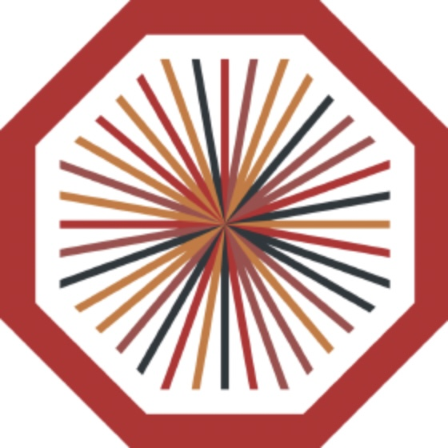
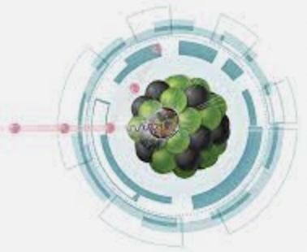

# Table of Content

### LBL 

- **[Useful pyjetty notes](alice/pyjetty_notes.md)**
- **[Data on hiccup and fastsim](alice/hiccup_data_and_fastsim.md)**
- **[Notes on pyjetty structure](alice/pyjetty_structure.md)**
- **[TREX justification](misc/trex.md)**

### ALICE 

- **[ALICE analysis notes and papers](alice/alice_analysis_notes.md)**
- **[O2 notes](alice/o2notes.md)**
- **[Hyperloop operator training](alice/hyperloop_operator.md)**
- **[ITS3 Test Beam Analysis](alice/its3_test_beam.md)**
- **[JSUB Coordination](alice/jsub.md)**
- **[Useful links](alice/alice_links.md)**

### NERSC 

- **[Installing Software](nersc/installing_root.md)**
- **[Using Jupyter Notebooks on Cori](nersc/jupyter.md)**
- **[ML on Perlmutter](nersc/ml_on_perlmutter.md)**

### EIC 

- **[EIC Links](eic/eic_links.md)**
- **[Fun4All commands for visualization](eic/fun4all_event_display.md)** 
- **[DD4HEP on Cori](eic/dd4hep.md)**
- **[Realistic Tracking](eic/realistic_tracking.md)**

### Python 

- **[Notes and links on Python](python.md)** 

### Machine Learning 

- **[ML Notes and Shortcuts](ml/ml.md)** 

### Structured Query Language (SQL) 

- **[SQL Notes and Shortcuts](sql/sql.md)** 

### Useful Links

- **[Installing software](misc/installing_software.md)**
- **[PYTHIA notes](misc/pythia.md)**
- **[LaTeX diff](misc/latex_diff.md)**
- **[PRL word count](misc/prl_wordcount.md)**
- **[screen command](misc/screen.md)**
- **[Splitting the screen with vim](misc/vim_commands.md)**
- **[Profiling python code](misc/profiling_python_code.md)**
- **[Markdown cheat-sheet](https://github.com/adam-p/markdown-here/wiki/Markdown-Cheatsheet)**
- **[Github tips](https://ohshitgit.com)**
- **[WebPlotDigitizer](https://automeris.io/WebPlotDigitizer/)**
- **[LaTeX Tables Generator](https://www.tablesgenerator.com)**
- **[Important 2022-23 Conferences](https://indico.cern.ch/event/1120106/contributions/4703309/attachments/2379961/4066282/conferences.pdf)**
- **[14 Must-Know pip Commands For Data Scientists and Engineers](https://towardsdatascience.com/14-must-know-pip-commands-for-data-scientists-and-engineers-a59ebbe0a439)**

### Fun links

- **[Countries I have been to](misc/countries.md)**
- **[A new map of the standard model of particle physics](https://www.quantamagazine.org/a-new-map-of-the-standard-model-of-particle-physics-20201022/)**
