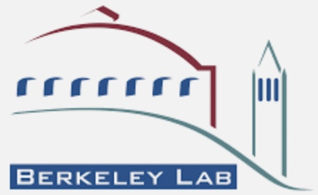
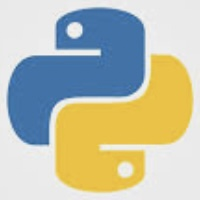

# Table of Content

## LBL 

- [Useful pyjetty notes](alice/pyjetty_notes.md) 

- [Data on hiccup and fastsim](alice/hiccup_data_and_fastsim.md) 

- [Notes on pyjetty structure](alice/pyjetty_structure.md) 

- [TREX justification](misc/trex.md) 

## ALICE 

- **[ALICE analysis notes and papers](alice/alice_analysis_notes.md)** 

- **[Hyperloop operator training](alice/hyperloop_operator.md)** 

- **[ITS3 Test Beam Analysis](alice/its3_test_beam.md)** 

- **[JSUB Coordination](alice/jsub.md)** 

- **[Useful links](alice/alice_links.md)** 

## NERSC 

- **[Installing Software](nersc/installing_root.md)** 

- **[Using Jupyter Notebooks on Cori](nersc/jupyter.md)** 

- **[ML on Perlmutter](nersc/ml_on_perlmutter.md)** 

## EIC 

- **[EIC Links](eic/eic_links.md)** 

- **[Fun4All commands for visualization](eic/fun4all_event_display.md)** 

- **[DD4HEP on Cori](eic/dd4hep.md)** 

- **[Realistic Tracking](eic/realistic_tracking.md)** 

## Python 

- **[Notes and links on Python](python.md)** 

## Machine Learning 

- **[ML Notes and Shortcuts](ml/ml.md)** 

## Structured Query Language (SQL) 

- **[SQL Notes and Shortcuts](sql/sql.md)** 

## Useful Links

- **[Installing software](misc/installing_software.md)** 

- **[PYTHIA notes](misc/pythia.md)** 

- **[LaTeX diff](misc/latex_diff.md)** 

- **[PRL word count](misc/prl_wordcount.md)** 

- **[screen command](misc/screen.md)** 

- **[Splitting the screen with vim](misc/vim_commands.md)** 

- **[Profiling python code](misc/profiling_python_code.md)** 

- **[Markdown cheat-sheet](https://github.com/adam-p/markdown-here/wiki/Markdown-Cheatsheet)** 

- **[Github tips](https://ohshitgit.com)** 

- **[WebPlotDigitizer](https://automeris.io/WebPlotDigitizer/)** 

- **[LaTeX Tables Generator](https://www.tablesgenerator.com)** 

- **[Important 2022-23 Conferences](https://indico.cern.ch/event/1120106/contributions/4703309/attachments/2379961/4066282/conferences.pdf)** 

- **[14 Must-Know pip Commands For Data Scientists and Engineers](https://towardsdatascience.com/14-must-know-pip-commands-for-data-scientists-and-engineers-a59ebbe0a439)** 

## Fun links

- **[Countries I have been to](misc/countries.md)** 

- **[A new map of the standard model of particle physics](https://www.quantamagazine.org/a-new-map-of-the-standard-model-of-particle-physics-20201022/)** 
