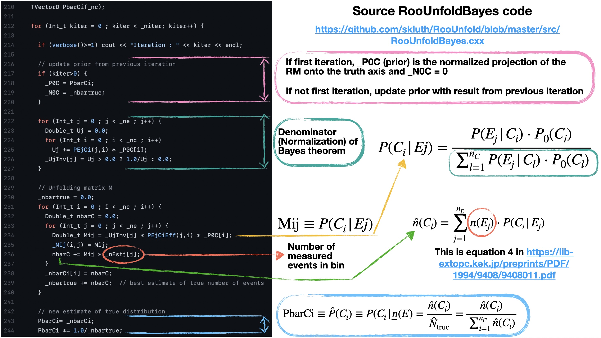

## Notes on pyjetty structure
[Back to table of Contents](../README.md)

* plots found in ```performance/mc_projections_both```, ```performance/mc_projections_det```, and ```performance/mc_projections_truth``` are put together in:
```analysis/user/rey/plotting_utils.py```

the function ```plot_obs_projection``` gets called in ```plot_obs_projections``` (note s at the end) a couple of times.

* plots found in ```main/Unfolded_...``` are put together in:
```analysis/user/substructure/roounfold_obs.py```

* prior scaling is done in: ```/home/rey/pyjetty/cpptools/src/rutil/rutil.cxx```

## Closure Tests:

* closure tests done in: ```analysis/user/substructure/roounfold_obs.py``` in the function ```unfolding_checks```

   - refolding test: ```refolding_test```
   - and statistical closure test: ```statistical_closure_test```
   - shape closure test done in function: ```shape_closure_test```
      - the shape closure test uses the function ```scale_by_prior``` defined in ```analysis/base/analysis_utils.py```
   - thermal closure test: ```plot_thermal_closure_test```

## Response-Matrix Slices:

* response-matrix slices plotted in: ```analysis/user/substructure/roounfold_obs.py``` (see function ```plot_RM_slices```)

## Bayesian Unfolding

Done in ```analysis/user/substructure/roounfold_obs.py```. Search the code for the line that reads ```unfold_bayes = ROOT.RooUnfoldBayes(response, hData, i)```. The unfolded (truth) distribution is then obtained by doing: ```hUnfolded = unfold_bayes.Hreco(self.errorType)```. See documentation for these functions [here](https://hepunx.rl.ac.uk/~adye/software/unfold/htmldoc-dev/RooUnfoldBayes.html). The Bayes RooUnfold source code is [here](https://github.com/skluth/RooUnfold/blob/master/src/RooUnfoldBayes.cxx). This class inherits from [here](https://github.com/skluth/RooUnfold/blob/master/src/RooUnfold.cxx). Additional notes are [here](https://gitlab.cern.ch/RooUnfold/RooUnfold/-/blob/master/README.md) and a practical example is [here](https://gitlab.cern.ch/RooUnfold/RooUnfold/blob/master/examples/RooUnfoldExample.py).

```
TVectorD PbarCi(_nc);

for (Int_t kiter = 0 ; kiter < _niter; kiter++) {

	if (verbose()>=1) cout << "Iteration : " << kiter << endl;

    	// update prior from previous iteration
    	if (kiter>0) {
      		_P0C = PbarCi;
      		_N0C = _nbartrue;
    	}

    	for (Int_t j = 0 ; j < _ne ; j++) {
      		Double_t Uj = 0.0;
      		for (Int_t i = 0 ; i < _nc ; i++)
        		Uj += PEjCi(j,i) * _P0C[i];
      		_UjInv[j] = Uj > 0.0 ? 1.0/Uj : 0.0;
    	}

    	// Unfolding matrix M
    	_nbartrue = 0.0;
    	for (Int_t i = 0 ; i < _nc ; i++) {
      		Double_t nbarC = 0.0;
      		for (Int_t j = 0 ; j < _ne ; j++) {
        		Double_t Mij = _UjInv[j] * PEjCiEff(j,i) * _P0C[i];
        		_Mij(i,j) = Mij;
        		nbarC += Mij * _nEstj[j];
      		}
      		_nbarCi[i] = nbarC;
      		_nbartrue += nbarC;  // best estimate of true number of events
    	}

    	// new estimate of true distribution
    	PbarCi= _nbarCi;
    	PbarCi *= 1.0/_nbartrue;
```

A breakdown of what's happening in the code above is represented below:



## Embedding

See function ```analyze_event``` in ```user/substructure/process_mc_base.py```.

The embedding is done right after a comment that reads ```# If Pb-Pb, construct embedded event (do this once, for all jetR)```