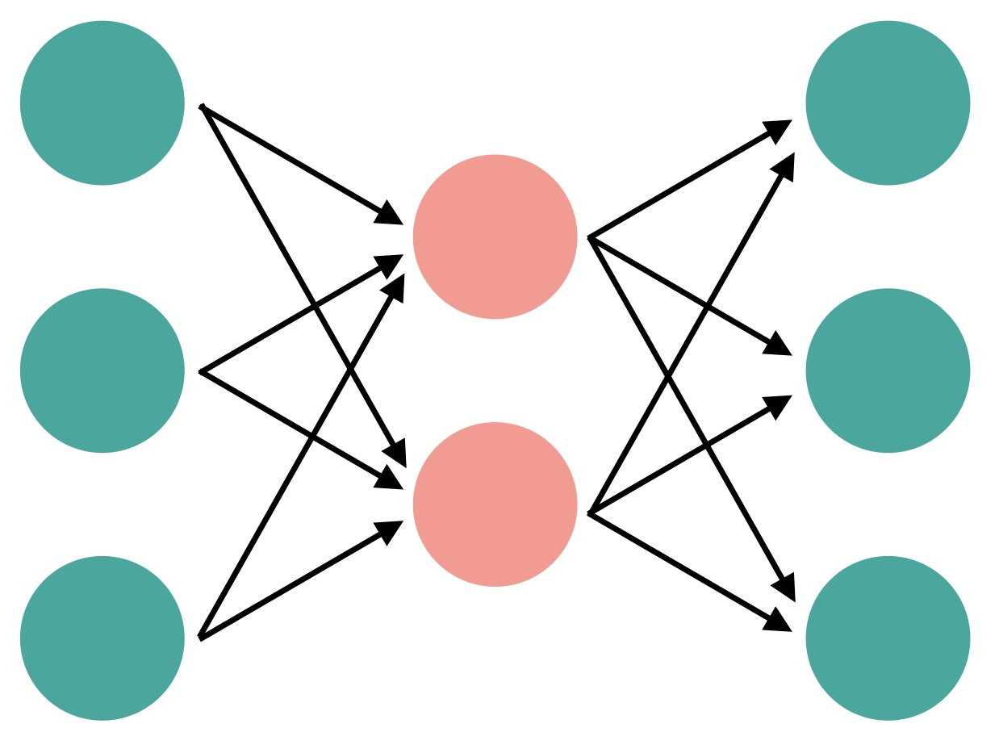
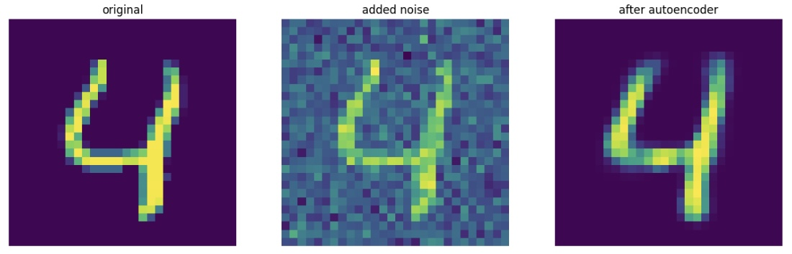

## Autoencoders

<a><button name="button" style = "color:red;width:200px;height:30px;cursor:pointer" onclick="window.location.href='https://reynier0611.github.io';">**Back to Table of Content**</button></a> <a><button name="button" style = "color:blue;width:200px;height:30px;cursor:pointer" onclick="window.location.href='https://reynier0611.github.io/ml/ml.html';">**Back to ML**</button></a>

#### Autoencoder for simple 3-feature data

- Instead of the Adam optimizer, with autoencoders we want to use Stochastic Gradient Descent so that we can play with the learning rate.

```python
from tensorflow.keras.models import Sequential
from tensorflow.keras.layers import Dense
from tensorflow.keras.optimizers import SGD
```

This model will have an encoder that compresses the data from 3 dimensions to 2, and then a decoder that expands from 2 back to 3 dimensions, as shown in the diagram below:



```python
encoder = Sequential()
encoder.add(Dense(2,activation='relu',input_shape=[3]))

decoder = Sequential()
decoder.add(Dense(3,activation='relu',input_shape=[2]))

autoencoder = Sequential([encoder,decoder])
autoencoder.compile(loss='mse',optimizer=SGD(learning_rate=1.5))
```

We will train both the encoder and decoder together, but then will use the encoder by itself to see the reduced dataset:

```python
from sklearn.preprocessing import MinMaxScaler
scaler = MinMaxScaler()
scaled_data = scaler.fit_transform(data)

autoencoder.fit(scaled_data,scaled_data,epochs=5)
```

```python
encoded_2dim = encoder.predict(scaled_data)
```

#### Autoencoder for image noise reduction

Create and compile the model:

```python
from tensorflow.keras.layers import GaussianNoise

encoder = Sequential()
encoder.add(Flatten(input_shape=[28,28]))
encoder.add(GaussianNoise(0.2)) # Adding noise to input image
encoder.add(Dense(400,activation='relu'))
encoder.add(Dense(200,activation='relu'))
encoder.add(Dense(100,activation='relu'))
encoder.add(Dense(50,activation='relu'))
encoder.add(Dense(25,activation='relu'))

decoder = Sequential()
decoder.add(Dense(50,activation='relu',input_shape=[25]))
decoder.add(Dense(100,activation='relu'))
decoder.add(Dense(200,activation='relu'))
decoder.add(Dense(400,activation='relu'))
decoder.add(Dense(784,activation='sigmoid'))
decoder.add(Reshape([28,28]))

noise_remover = Sequential([encoder,decoder])

noise_remover.compile(loss='binary_crossentropy', optimizer='adam', metrics=['accuracy'])
```

Fit the model and use it to generate 10 de-noised images:

```python
noise_remover.fit(X_train,X_train,epochs=8)

ten_noisey_images = sample(X_test[:10],training=True)
denoised = noise_remover(ten_noisey_images)
```

Check the effect on these images:

```python
n = 4
fix,ax = plt.subplots(ncols=3,figsize=(15,5))
ax[0].imshow(X_test[n])
ax[1].imshow(ten_noisey_images[n])
ax[2].imshow(denoised[n])
```

