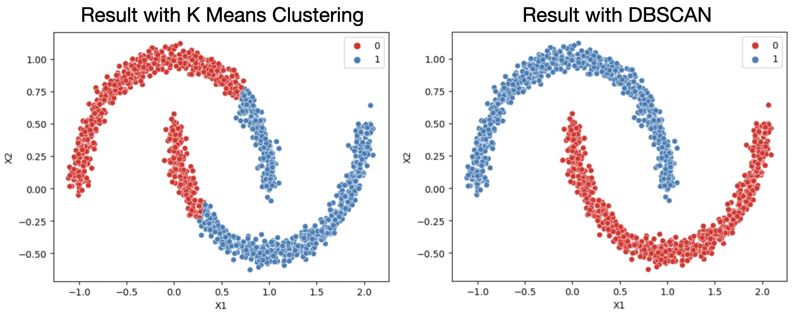
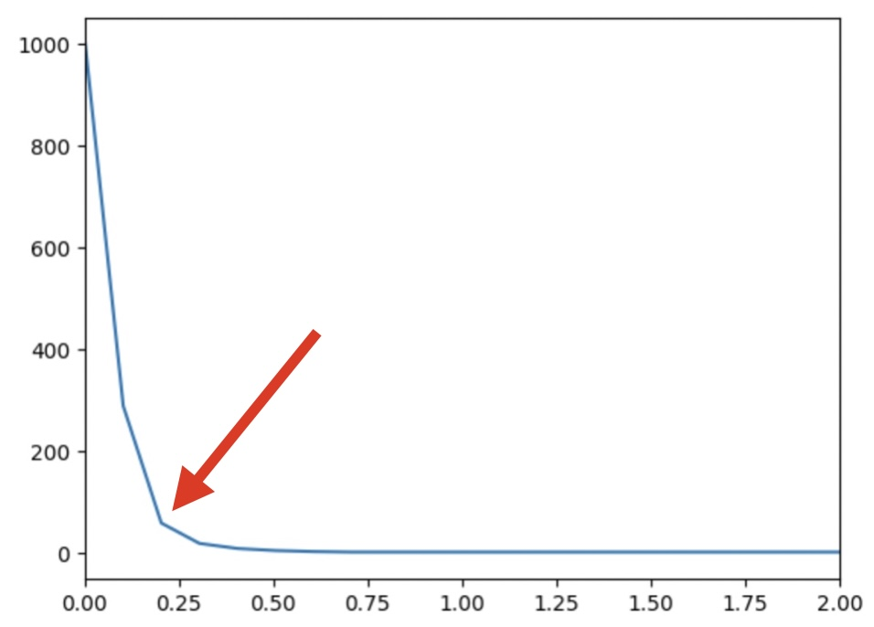

## DBSCAN

<a><button name="button" style = "color:red;width:200px;height:30px;cursor:pointer" onclick="window.location.href='https://reynier0611.github.io';">**Back to Table of Content**</button></a> <a><button name="button" style = "color:blue;width:200px;height:30px;cursor:pointer" onclick="window.location.href='https://reynier0611.github.io/ml/ml.html';">**Back to ML**</button></a>

Density based. Very good for non-linearly-separable distributions.

```python
from sklearn.cluster import DBSCAN

labels = model.fit_predict(data)
model = DBSCAN(eps=0.15)
sns.scatterplot(data=data,x='X1',y='X2',hue=labels,palette='Set1')
```



```python
outlier_percent = []
number_of_outliers= []

for eps in np.linspace(0.001,10,100):
    dbscan = DBSCAN(eps=eps)
    dbscan.fit(two_blobs_outliers)
    
    number_of_outliers.append(np.sum(dbscan.labels_ == -1))
    outlier_percent.append(100 * np.sum(dbscan.labels_ == -1)/len(dbscan.labels_))

sns.lineplot(x=np.linspace(0.001,10,100),y=number_of_outliers)
```


