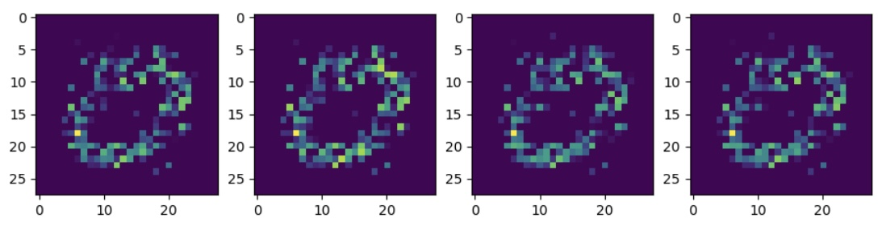

## Generative Adversarial Network (GAN)

<a><button name="button" style = "color:red;width:200px;height:30px;cursor:pointer" onclick="window.location.href='https://reynier0611.github.io';">**Back to Table of Content**</button></a> <a><button name="button" style = "color:blue;width:200px;height:30px;cursor:pointer" onclick="window.location.href='https://reynier0611.github.io/ml/ml.html';">**Back to ML**</button></a>

###### Phase 1: Train the discriminator

- Real images (labeled 1) are combined with fake images (labeled 0). The discriminator is trained to distinguish real from fake. Backpropagation only updates the discriminator weights.

###### Phase 2: Train the generator

- Produce fake images with generator. Feed only these fake images to discriminator with labels 1. The discriminator will realize these images are fake. This will cause the generator to get better at forging images that the discriminator believes are real. In this step backpropagation only updates the generator weights.


#### GAN full example:

1. The data:

```python
from tensorflow.keras.datasets import mnist
(X_train, y_train), (X_test, y_test) = mnist.load_data()
only_zeros = X_train[y_train==0]
```

2. The model:

```python
import tensorflow as tf
from tensorflow.keras.layers import Dense, Reshape, Flatten
from tensorflow.keras.models import Sequential
```

- Discriminator:

```python
discriminator = Sequential()
discriminator.add(Flatten(input_shape=[28,28]))
discriminator.add(Dense(150,activation='relu'))
discriminator.add(Dense(100,activation='relu'))
discriminator.add(Dense(1,activation='sigmoid'))
discriminator.compile(loss='binary_crossentropy',optimizer='adam')
```

- Generator

```python
codings_size = 100

generator = Sequential()
generator.add(Dense(100,activation='relu',input_shape=[codings_size]))
generator.add(Dense(150,activation='relu'))
generator.add(Dense(784,activation='relu'))
generator.add(Reshape([28,28]))
```

* Note that we compiled the discriminator but not the generator, because the generator itself is trained through the full GAN model.

- GAN:

```python
GAN = Sequential([generator,discriminator])
discriminator.trainable = False
GAN.compile(loss='binary_crossentropy',optimizer='adam')
```

3. Training batches

```python
batch_size = 32
my_data = only_zeros

dataset = tf.data.Dataset.from_tensor_slices(my_data).shuffle(buffer_size=1000)
dataset = dataset.batch(batch_size,drop_remainder=True).prefetch(1)

epochs = 10

generator, discriminator = GAN.layers

for epoch in range(epochs):
    print('Currently on epoch {}'.format(epoch))
    
    i = 0
    
    for X_batch in dataset:
        i = i+1
        
        if i%50 == 0:
            print('\t currently on batch {}'.format(i))
            
        # DISCRIMINATOR TRAINING PHASE
        noise = tf.random.normal(shape=[batch_size,codings_size])
        
        gen_images = generator(noise)
        
        # Concatenate the fake and real images
        X_fake_vs_real = tf.concat([gen_images,tf.dtypes.cast(X_batch,tf.float32)],axis=0)
        
        # set the corresponding labels
        y1 = tf.constant([0.0]*batch_size + [1.0]*batch_size)
        
        discriminator.trainable = True
        
        discriminator.train_on_batch(X_fake_vs_real,y1)
        
        # GENERATOR TRAINING PHASE
        noise = tf.random.normal(shape=[batch_size,codings_size])
        
        y2 = tf.constant([[1.0]]*batch_size)
        
        discriminator.trainable = False
        
        GAN.train_on_batch(noise,y2)
```

4. Testing model:

```python
noise = tf.random.normal(shape=[10,codings_size])
images = generator(noise)

fig,ax = plt.subplots(ncols=4,figsize=(11,3))
for i in range(4):
    ax[i].imshow(images[i])
```


