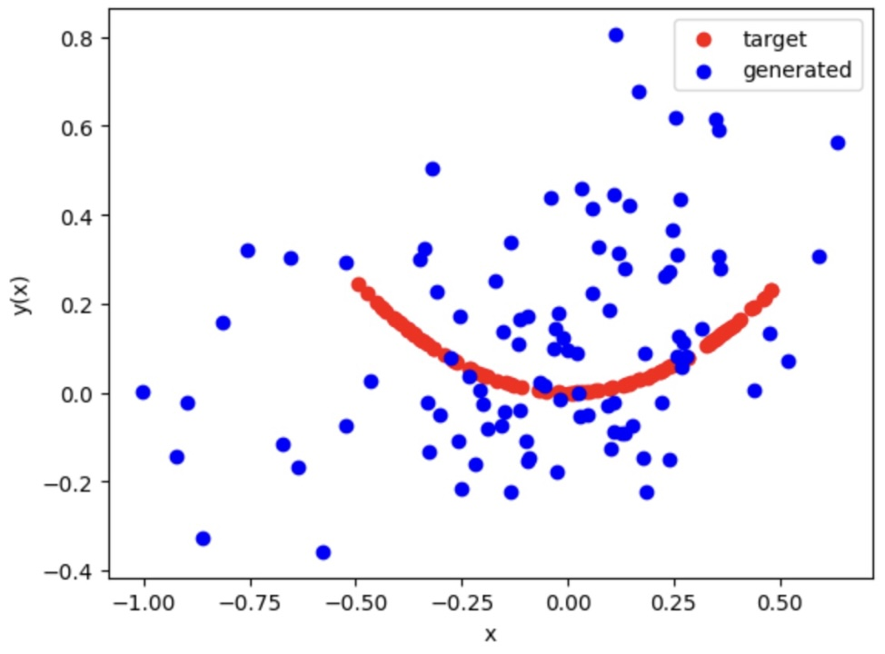
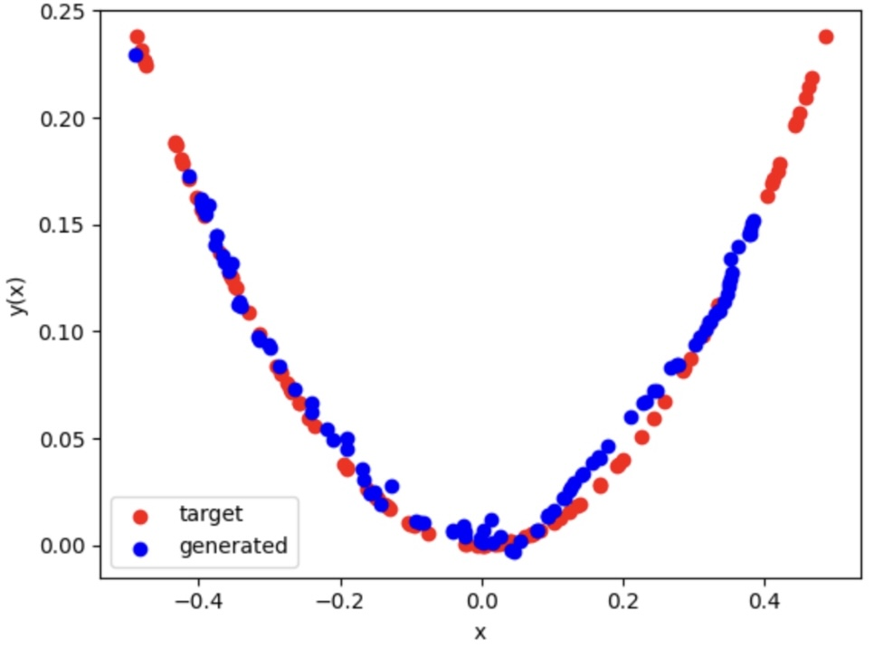

## Generative Adversarial Network (GAN)

<a><button name="button" style = "color:red;width:200px;height:30px;cursor:pointer" onclick="window.location.href='https://reynier0611.github.io';">**Back to Table of Content**</button></a> <a><button name="button" style = "color:blue;width:200px;height:30px;cursor:pointer" onclick="window.location.href='https://reynier0611.github.io/ml/ml.html';">**Back to ML**</button></a>

Example taken from tutorial by Hasin Brownlee on [How to Develop a 1D Generative Adversarial Network From Scratch in Keras](https://machinelearningmastery.com/how-to-develop-a-generative-adversarial-network-for-a-1-dimensional-function-from-scratch-in-keras/).

GANs have a generator and discriminator models.

- generator: responsible for generating new samples from the domain
- discriminator: responsible for classifying whether samples are real or fake (generated).

Important: performance of discriminator is used to update both the model weights of the discriminator itself and the generator model. The generator never sees examples from the domain and is adapted based on how well the discriminator performs.

### "Getting" (more like generating) the "real data":

Generate uniformly random values between 0 and 1, and shift them to the range -0.5 and 0.5. Then, calculate output value for each randomly generated input value and combine the arrays into a single NumPy array with n rows (100) and two columns.

```python
# example of generating random samples from y = x^2

import matplotlib.pyplot as plt
import numpy as np
from numpy.random import rand
from numpy import hstack
 
# generate random sample from x^2
def generate_real_samples(n=100):

    # generate random inputs in [-0.5, 0.5]
    X1 = rand(n) - 0.5

    # generate outputs X^2 (quadratic)
    X2 = X1 * X1
    
    # stack arrays
    X1 = X1.reshape(n, 1)
    X2 = X2.reshape(n, 1)
    X = hstack((X1, X2))

    # generate class labels
    y = np.ones((n, 1))

    return X, y
```

### Define the (standalone) discriminator

- Inputs: Sample with two real values.
- Outputs: Binary classification, likelihood the sample is real (or fake).

In this simple example, the discriminator model will have one hidden layer with 25 nodes and we will use the ReLU activation function and the He weight initialization. The output layer will have one node for the binary classification using the sigmoid activation function.

The model will minimize the binary cross entropy loss function, with the Adam version of stochastic gradient descent.

```python
from keras.models import Sequential
from keras.layers import Dense
from keras.utils.vis_utils import plot_model

# define the standalone discriminator model
def define_discriminator(n_inputs=2):

    model = Sequential()

    model.add(Dense(25, activation='relu', kernel_initializer='he_uniform', input_dim=n_inputs))

    model.add(Dense(1, activation='sigmoid'))

    # compile model
    model.compile(loss='binary_crossentropy', optimizer='adam', metrics=['accuracy'])

    return model
```

### Define the (standalone) generator

- Inputs: Point in latent space, e.g. a five-element vector of Gaussian random numbers.
- Outputs: Two-element vector representing a generated sample for our function (x and x^2).

The generator model will have a single hidden layer with five nodes and will use the ReLU activation function and the He weight initialization. The output layer will have two nodes for the two elements in a generated vector and will use a linear activation function.

A linear activation function is used because we know we want the generator to output a vector of real values and the scale will be [-0.5, 0.5] for the first element and about [0.0, 0.25] for the second element.

IMPORTANT: The model is not compiled. The reason for this is that the generator model is not fit directly.

The function below defines and returns the generator model.

```python
# define the standalone generator model
def define_generator(latent_dim, n_outputs=2):

    model = Sequential()

    model.add(Dense(15, activation='relu', kernel_initializer='he_uniform', input_dim=latent_dim))

    model.add(Dense(n_outputs, activation='linear'))

    return model
```

### Training the generator model

Weights in the generator model are updated based on the performance of the discriminator model:

- When discriminator good at detecting fake samples: generator  updated more
- When discriminator bad at detecting fake samples: the generator model is updated less.

(zero-sum or adversarial relationship between the two models)

Generator only concerned with discriminator’s performance on fake examples. Therefore, all layers in discriminator are set to ```not trainable``` when it is part of the GAN model so that they can not be updated on fake examples.

When training the generator, we want the discriminator to think that the samples output by the generator are real. Thus, when the generator is trained as part of GAN, we mark the generated samples as real (class 1). The discriminator will then classify the generated samples as not real (class 0). The backpropagation process used to update the model weights will see this as a large error and will update the model weights (i.e. only the weights in the generator) to correct for this error, in turn making the generator better at generating plausible fake samples.

```python
# generate points in latent space as input for the generator
def generate_latent_points(latent_dim, n):

    # generate points in the latent space
    x_input = np.random.randn(latent_dim * n)

    # reshape into a batch of inputs for the network
    x_input = x_input.reshape(n, latent_dim)

    return x_input
```

```python
# define the combined generator and discriminator model, for updating the generator
def define_gan(generator, discriminator):
    # make weights in the discriminator not trainable
    discriminator.trainable = False
    # connect them
    model = Sequential()
    # add generator
    model.add(generator)
    # add the discriminator
    model.add(discriminator)
    # compile model
    model.compile(loss='binary_crossentropy', optimizer='adam')
    return model
```

The trainable property impacts the model when it is compiled. The discriminator model was compiled with trainable layers, therefore the model weights in those layers will be updated when the standalone model is updated via calls to ```train_on_batch()```.

The discriminator model was marked as ```not trainable```, added to the GAN model, and compiled. In this model, the model weights of the discriminator model are not trainable and cannot be changed when the GAN model is updated via calls to ```train_on_batch()```.

```python
# use the generator to generate n fake examples, with class labels
def generate_fake_samples(generator, latent_dim, n):

    # generate points in latent space
    x_input = generate_latent_points(latent_dim, n)

    # predict outputs
    X = generator.predict(x_input)

    # create class labels
    y = np.zeros((n, 1))

    return X, y
```

### Evaluating the performance of the GAN

```python
# evaluate the discriminator and plot real and fake points
def summarize_performance(epoch, generator, discriminator, latent_dim, n=100):

    # prepare real samples
    x_real, y_real = generate_real_samples(n)

    # evaluate discriminator on real examples
    _, acc_real = discriminator.evaluate(x_real, y_real, verbose=0)

    # prepare fake examples
    x_fake, y_fake = generate_fake_samples(generator, latent_dim, n)

    # evaluate discriminator on fake examples
    _, acc_fake = discriminator.evaluate(x_fake, y_fake, verbose=0)

    # summarize discriminator performance
    print(epoch, acc_real, acc_fake)

    # scatter plot real and fake data points
    plt.scatter(x_real[:, 0], x_real[:, 1], color='red',label='target')
    plt.scatter(x_fake[:, 0], x_fake[:, 1], color='blue',label='generated')
    plt.ylabel('y(x)')
    plt.xlabel('x')
    plt.legend()
    plt.show()
```

For the actual training, we first update the discriminator model with real and fake samples, then update the generator via the composite model. The complete train function for updating the discriminator model and the generator (via the composite model) is listed below.

```python
# train the generator and discriminator
def train(g_model, d_model, gan_model, latent_dim, n_epochs=10000, n_batch=128, n_eval=2000):

    # determine half the size of one batch, for updating the discriminator
    half_batch = int(n_batch / 2)
    
    # manually enumerate epochs
    for i in range(n_epochs):

        # prepare real samples
        x_real, y_real = generate_real_samples(half_batch)

        # prepare fake examples
        x_fake, y_fake = generate_fake_samples(g_model, latent_dim, half_batch)

        # update discriminator
        d_model.train_on_batch(x_real, y_real)
        d_model.train_on_batch(x_fake, y_fake)

        # prepare points in latent space as input for the generator
        x_gan = generate_latent_points(latent_dim, n_batch)

        # create inverted labels for the fake samples
        y_gan = np.ones((n_batch, 1))

        # update the generator via the discriminator's error
        gan_model.train_on_batch(x_gan, y_gan)

        # evaluate the model every n_eval epochs
        if (i+1) % n_eval == 0:
            summarize_performance(i, g_model, d_model, latent_dim)
```

```python
# size of the latent space
latent_dim = 5

# create the discriminator
discriminator = define_discriminator()

# create the generator
generator = define_generator(latent_dim)

# create the gan
gan_model = define_gan(generator, discriminator)
# train model
train(generator, discriminator, gan_model, latent_dim)
```

### Results at the beginning of training



### Results at the end of training

