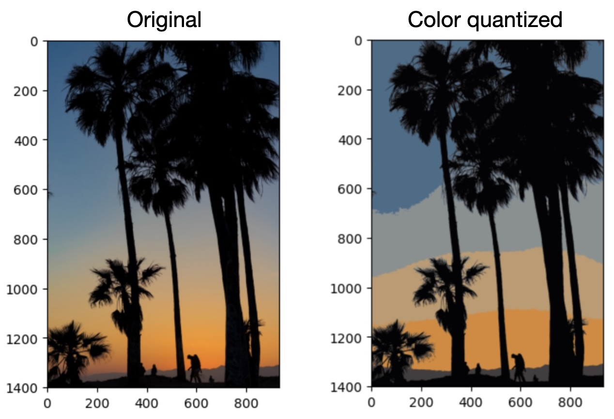

## K Means Clustering

<a><button name="button" style = "color:red;width:200px;height:30px;cursor:pointer" onclick="window.location.href='https://reynier0611.github.io';">**Back to Table of Content**</button></a> <a><button name="button" style = "color:blue;width:200px;height:30px;cursor:pointer" onclick="window.location.href='https://reynier0611.github.io/ml/ml.html';">**Back to ML**</button></a>

Begin by scaling the data:

```python
from sklearn.preprocessing import StandardScaler
scaler = StandardScaler()
scaled_X = scaler.fit_transform(X)
```

Create model and train:

```python
from sklearn.cluster import KMeans
model = KMeans(n_clusters=2)
cluster_labels = model.fit_predict(scaled_X)
```

The number of clusters is not always clear. We can use a knee method to find a good value:

```python
ssd = []

for k in range(2,10):
    model = KMeans(n_clusters=k)
    model.fit(scaled_X)
    
    ssd.append(model.inertia_)
```

#### Color quantization example:

```python
import matplotlib.image as mpimg
image = mpimg.imread('palm_trees.jpg')

plt.imshow(image)

(h,w,c) = image.shape
image_2d = image.reshape(h*w,c)

model = KMeans(n_clusters=6)
labels = model.fit_predict(image_2d)
rgb_codes = model.cluster_centers_.round(0).astype(int)
new_image = rgb_codes[labels]
new_image = np.reshape(new_image,(h,w,c))
```

