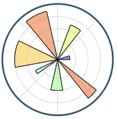

## Matplotlib 

<a><button name="button" style = "color:red;width:200px;height:30px;cursor:pointer" onclick="window.location.href='https://reynier0611.github.io';">**Back to Table of Content**</button></a> <a><button name="button" style = "color:blue;width:200px;height:30px;cursor:pointer" onclick="window.location.href='https://reynier0611.github.io/ml/ml.html';">**Back to ML**</button></a>

```python
import matplotlib.pyplot as plt
%matplotlib inline
```

```python
plt.plot(x,y)
plt.xlim(0,5)
plt.title('Title')
plt.xlabel('x axis')
plt.ylabel('y axis')
```

### Interactive 3D image

```python
%matplotlib notebook
fig = plt.figure()
ax = fig.add_subplot(111,projection='3d')
ax.scatter(feat['X1'],feat['X2'],feat['X3'],c=y)
```