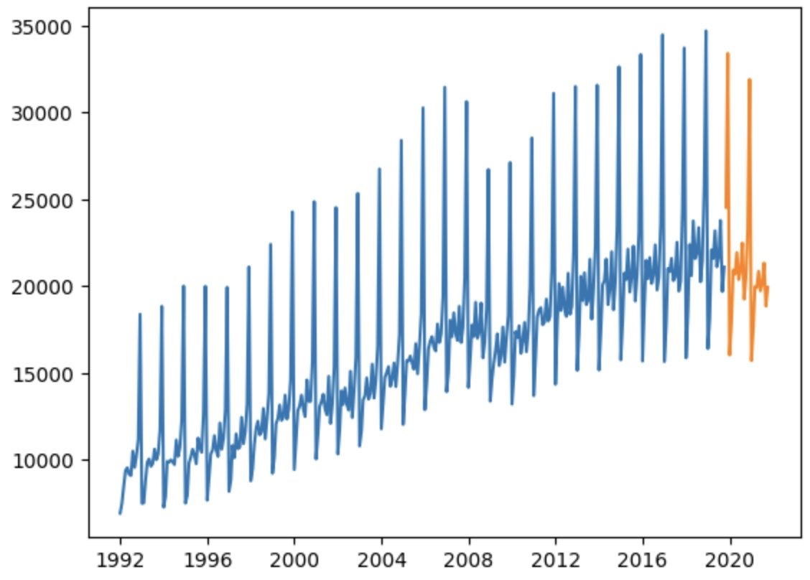

## Recurring Neural Networks

<a><button name="button" style = "color:red;width:200px;height:30px;cursor:pointer" onclick="window.location.href='https://reynier0611.github.io';">**Back to Table of Content**</button></a> <a><button name="button" style = "color:blue;width:200px;height:30px;cursor:pointer" onclick="window.location.href='https://reynier0611.github.io/ml/ml.html';">**Back to ML**</button></a>

#### Single-variate RNN

Imagine we are loading a csv file with two columns. The first one is a date-time string (called ```DATE```, and the second one is the value we want to forecast. The following command loads the csv file into a dataframe and assigns the date-time info to the index. Setting ```parse_dates=True``` ensures the date-time information is read in as a date-time object and not as a string:

```python
df = pd.read_csv('data.csv',parse_dates=True,index_col='DATE')
```

Assume each row represents a month and that we want as our test sample the last 24 months of data:

```python
test_size = 24
test_ind = len(df) - test_size
train = df.iloc[:test_ind]
test = df.iloc[test_ind:]
```

Now scale the data:

```python
from sklearn.preprocessing import MinMaxScaler
scaler = MinMaxScaler()
scaled_train = scaler.fit_transform(train)
scaled_test = scaler.transform(test)
```

and create a time series generator with length of 20 months and a batch size of 1:

```python
from tensorflow.keras.preprocessing.sequence import TimeseriesGenerator
length = 20
batch_size = 1
generator = TimeseriesGenerator(scaled_train,scaled_train,
                           length=length,batch_size=batch_size)
```

Create the model. Here we will use a Long Short-Term Memory ([LSTM](https://keras.io/api/layers/recurrent_layers/lstm/)) layer. Alternatively we could have used a [SimpleRNN](https://keras.io/api/layers/recurrent_layers/simple_rnn/) layer, but LSTM tends to work better:

```python
from tensorflow.keras.models import Sequential
from tensorflow.keras.layers import LSTM, Dense

n_features = 1

model = Sequential()
model.add(LSTM(100,activation='relu',input_shape=(length,n_features)))
model.add(Dense(1))
model.compile(loss='mse',optimizer='adam')
```

Let's now create a validation generator with the test data:

```python
test_generator = TimeseriesGenerator(scaled_test,scaled_test,
                                    length=length,batch_size=batch_size)
```

Create and early stop callback and train the model:

```python
from tensorflow.keras.callbacks import EarlyStopping
early_stop = EarlyStopping(monitor='val_loss',patience=3)
model.fit(generator,epochs=50,validation_data=test_generator,callbacks=[early_stop])
```

Plot the history of the loss that occured during training:

```python
loss = pd.DataFrame(model.history.history)
loss.plot()
```

Finally, to evaluate the model, we can forecast predictions for test data range (the last 24 months of the entire dataset). We have to inverse the scaling transformations:

```python
predictions = []

first_batch = scaled_train[-length:]
current_batch = first_batch.reshape(batch_size,length,n_features)

for i in range(len(test)):
    current_pred = model.predict(current_batch)[0]
    
    predictions.append(current_pred)
    
    current_batch = np.append(current_batch[:,1:,:],[[current_pred]],axis=1)

preds = scaler.inverse_transform(predictions)
test['predictions'] = preds
```

See below an example of forecast (orange) after training on the (blue) data:


