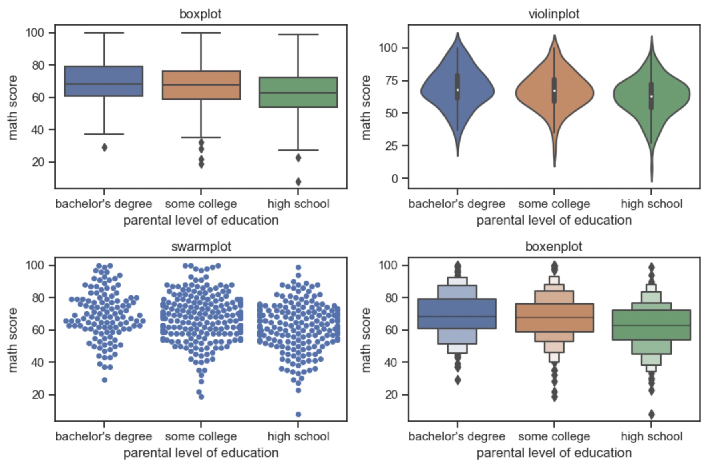

## Seaborn 

<a><button name="button" style = "color:red;width:200px;height:30px;cursor:pointer" onclick="window.location.href='https://reynier0611.github.io';">**Back to Table of Content**</button></a> <a><button name="button" style = "color:blue;width:200px;height:30px;cursor:pointer" onclick="window.location.href='https://reynier0611.github.io/ml/ml.html';">**Back to ML**</button></a>

```python
import seaborn as sns
```

```python
scat = sns.scatterplot(x='A',y='B',data=df,hue='C')
```


```python
sns.rugplot(x='A',data=df)
sns.displot(data=df,x='A',bins=20)
sns.histplot(data=df,x='A',bins=20,kde=True)
sns.kdeplot(data=df,x='A')
```


```python
sns.countplot(data=df,x='A')
sns.barplot(data=df,x='A',y='B',estimator=np.mean,ci='sd')
```


```python
sns.boxplot(data=df,y='numerical data',x='categories')
sns.violinplot(data=df,y='numerical data',x='categories')
sns.swarmplot(data=df,x='numerical data',y='categories')
sns.boxenplot(data=df,x='numerical data',y='categories')
```



### Comparison plots

```python
sns.jointplot(data=df,x='A',y='B',kind='scatter') # or kind hex, hist, kde
```


```python
sns.pairplot(data=df)
```


```python
sns.catplot(data=df,x='numerical var',y='cat 1',kind='box',row='cat 2',col='cat 3')


g = sns.PairGrid(df)
g = g.map_upper(sns.scatterplot)
g = g.map_lower(sns.kdeplot)
g = g.map_diag(sns.histplot)

sns.heatmap(data=df,linewidth=0.5,annot=True, cmap='viridis')

sns.clustermap(data=df,linewidth=0.5,annot=True, cmap='viridis')
```
