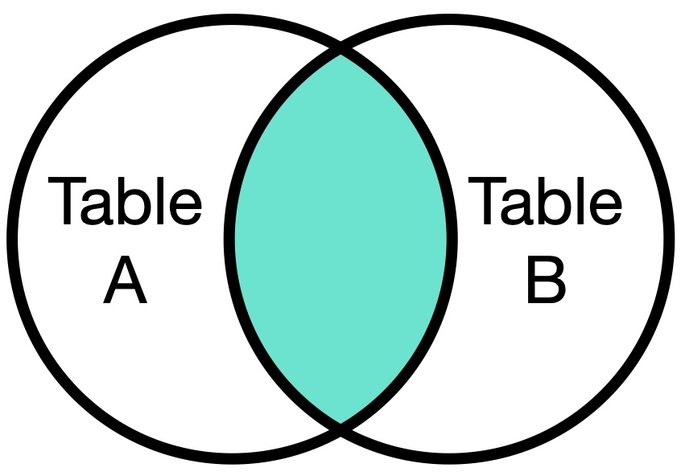
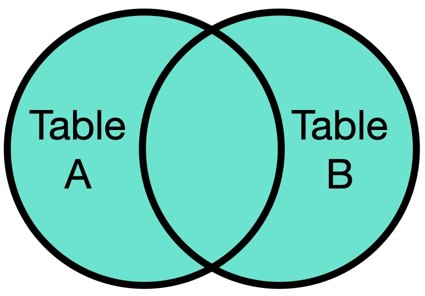
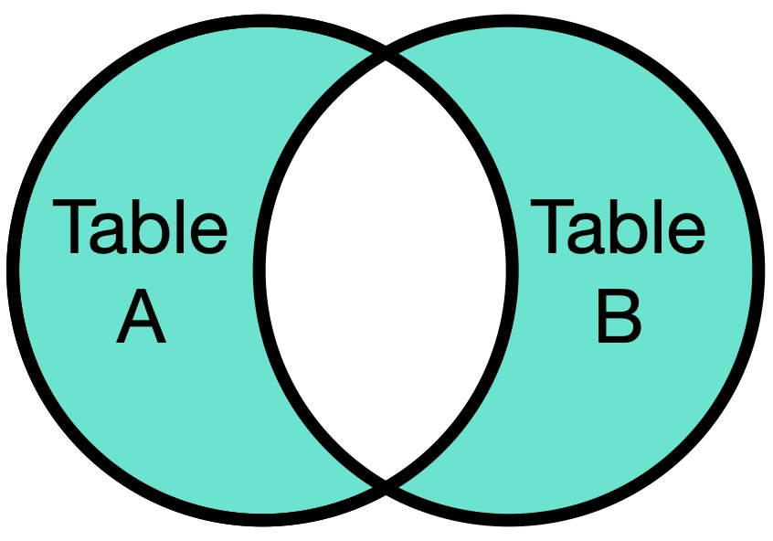
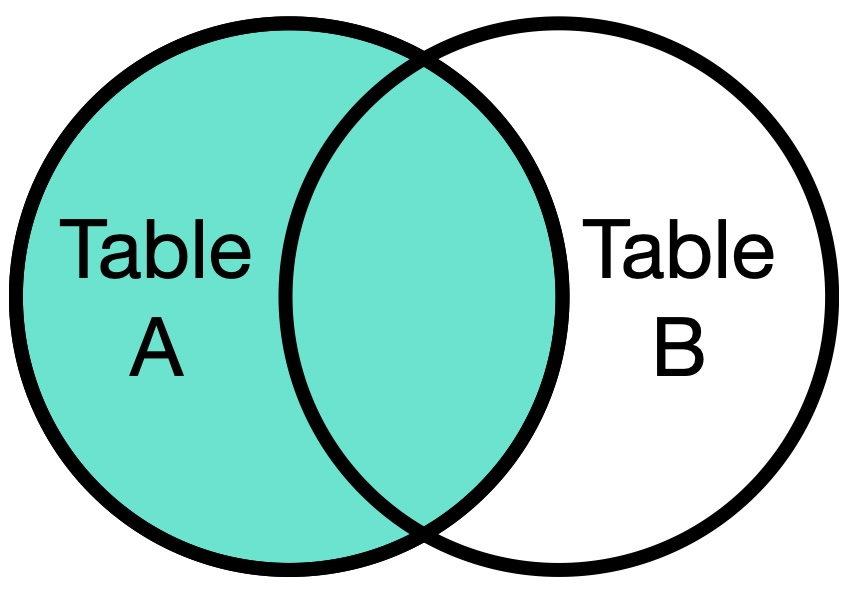
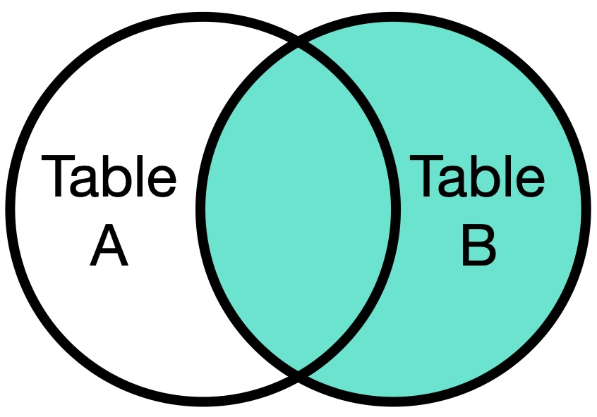

## JOINS and UNION

<a><button name="button" style = "color:red;width:200px;height:30px;cursor:pointer" onclick="window.location.href='https://reynier0611.github.io';">**Back to Table of Content**</button></a> <a><button name="button" style = "color:blue;width:200px;height:30px;cursor:pointer" onclick="window.location.href='https://reynier0611.github.io/sql/sql.html';">**Back to SQL**</button></a>


### JOINS

- [Visual example of SQL JOINS](https://blog.codinghorror.com/a-visual-explanation-of-sql-joins/)
- [SQL JOIN Examples](https://www.talend.com)
- [Wikipedia page on SQL JOINS](https://en.wikipedia.org/wiki/Join_(SQL))

#### INNER JOIN



```sql
SELECT * FROM TableA INNER JOIN TableB
ON TableA.col_match = TableB.col_match
```

When only ```JOIN``` instead of ```INNER JOIN``` is specified, SQL performs an inner join.

The columns we join on will be duplicated. We can specify that we only want one of the two:

```sql
SELECT col1, TableA.col2, col3 FROM TableA INNER JOIN TableB
ON TableA.col2 = TableB.col2
```

#### FULL OUTER JOIN



```sql
SELECT * FROM TableA FULL OUTER JOIN TableB
ON TableA.col_match = TableB.col_match
```

#### FULL OUTER JOIN with WHERE

```sql
SELECT * FROM TableA FULL OUTER JOIN TableB
ON TableA.col_match = TableB.col_match
WHERE TableA.id IS null OR TableB.id IS null
```



- Can use ```NULL``` or ```null```.

#### LEFT OUTER JOIN



```sql
SELECT * FROM TableA LEFT OUTER JOIN TableB
ON TableA.col_match = TableB.col_match
```

- Can use ```LEFT OUTER JOIN``` or simply ```LEFT JOIN```.

#### RIGHT OUTER JOIN



```sql
SELECT * FROM TableA RIGHT OUTER JOIN TableB
ON TableA.col_match = TableB.col_match
```

### UNION

- Like concatenation in pandas.

```sql
SELECT column_name(s) FROM table1
UNION
SELECT column_name(s) FROM table2
```